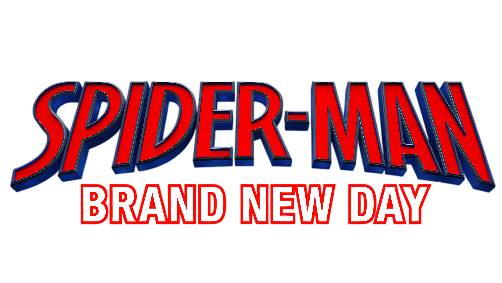

<p align="center">
  
</p>

<p align="center">
  <em>A 2D action-platformer fan game built step by step with Python &amp; Pygame</em>
</p>

---

## Overview

**Spider-man Brand New Day** is a 2D side-scrolling action game developed interactively, one feature at a time. The project follows a "build-as-you-go" philosophy — each mechanic is added, tested, and refined before moving to the next, resulting in a clean, modular codebase that evolves organically.

Inspired by the classic arcade beat-'em-up feel, the game focuses on fluid movement, combo-based melee combat, web-swinging physics, and responsive controls.

---

## Features

### Movement
- **Walk / Run** — Smooth horizontal movement using the Left/Right arrows (or A/D keys).
- **Jump (turn-based)** — Press Space to jump. Odd turns = normal jump (`jump-right/left`); even turns = Olympic somersault with smooth 360° spin (`flip/f-i.png`). Works only from ground, turn counter persists across landings.
- **Crouch** — Down arrow (or S) to crouch on the ground.
- **Direction Turn** — Animated turn transition when reversing direction.
- **Sit-to-Idle** — After landing from a run, the character sits briefly before standing still.

### Combat
- **Combo System** — Press F to attack. Successive hits chain into a 21-step ground combo (3 phases × 7 hits).
- **Heavy Punch** — Press G (on ground) to execute "w-i", a powerful blow that launches the enemy (and yourself) into the air.
- **Charge Attacks** — Hold F during certain combo frames to charge; release for an enhanced hit.
- **Combo Memory** — The combo timer resets on each hit; idle too long and the chain resets.

### Shield
- **C** (toggle) — Raises a shield using `sh-right.png` / `sh-left.png`. Blocks horizontal movement and prevents attacks. Press C again to lower.

### Stealth / Ceiling Hang
- **H** (toggle) — Hangs upside down from the ceiling using `hf.png`. Character rises automatically toward the top of the screen; camera stays fixed. Once the character goes off-screen, they teleport to a different X position (depending on facing direction) and fall back down. Press H while rising to cancel and fall immediately.

### Web-Shooter
- **R** key (ground only) — Fires a web-shooter animation. Interruptible by combat.

### Swing & Catapult
- **E** — Toggle web-swing. A pendulum simulation with gravity, damping, and pump mechanics.
- **E while swinging** — Hop off the swing with preserved momentum, then auto-re-swing.
- **Q** — Catapult launch. If swinging, drops the web; if on ground, launches in a fixed arc.
- **Space while swinging** — Release the web at any time with current velocity.

### Camera
- Vertical follow camera with smooth interpolation.
- Ground-lock prevents the floor from scrolling below 85 % of the screen.

### Animations
- Frame-by-frame sprite animations loaded from individual GIF/PNG sequences.
- Dedicated animations for: idle, run, jump, crouch (sit), turn entry, punch, air attack, swing, web-shoot, shield, and olympic flip (f-i).
- Animated turn transitions (entry-left / entry-right).
- Programmatic smooth rotation for the somersault flip.

---

## Controls

| Key | Action |
|-----|--------|
| ← → / A D | Move left / right |
| SPACE | Jump (turn-based: odd=normal, even=flip) |
| ↓ / S | Crouch / Sit |
| F | Punch (combo chain) |
| G | Heavy punch "w-i" (ground only) |
| C | Shield toggle |
| H | Stealth — automatic ceiling rise + teleport |
| R | Web-shooter (ground only) |
| E | Start swing / Hop off swing |
| Q | Catapult launch |
| 1 | Damage self (testing) |
| 2 | Heal self (testing) |
| ESC | Exit game |

---

## Project Status

This game is a **work in progress** — each feature is built on demand, tested, and iterated. Current milestones:

- [x] Player movement & jumping
- [x] Turn-based jump system (normal / olympic flip)
- [x] Ground combo system (3 phases × 7 hits)
- [x] Heavy punch (w-i) with launch
- [x] Charge attacks
- [x] Crouch & sit mechanics
- [x] Direction turn animation
- [x] Shield / block toggle
- [x] Web-shooter (ground)
- [x] Web-swing (pendulum physics)
- [x] Catapult launch
- [x] Stealth / ceiling hang (hf.png)
- [x] Vertical camera follow
- [x] Screen shake on impacts
- [x] Olympic somersault (f-i.png procedural rotation)
- [ ] Enemies & AI
- [ ] Health system & damage
- [ ] Sound effects & music
- [ ] HUD & UI polish
- [ ] Level design & platforms
- [ ] Win / lose conditions

---

## Requirements

- Python 3.12+
- Pygame 2.6+

Install dependencies:

```bash
pip install pygame
```

---

## Running the Game

```bash
python test-player.py
```

> **Note:** Both `test-player.py` and `press-start-game.py` are entry points. `test-player.py` is the primary development sandbox.

---

## Project Structure

```
├── images-game/
│   ├── characters/Spider-man/   # Frame-by-frame GIF/PNG animations
│   ├── flip/                    # Olympic flip frames (f-i.png)
│   │   ├── right/
│   │   └── left/
│   └── game-logo/              # Title logo (logo.png)
├── sound-game/                 # Sound effects (WIP)
├── soundtrack-game/            # Music tracks (WIP)
├── voices-lines/               # Voice-over assets (WIP)
├── game-intro/                 # Intro assets (WIP)
├── test-player.py              # Main game file
├── press-start-game.py         # Alternate entry point
└── README.md                   # This file
```

---

## Development Approach

Every mechanic is implemented, tested, and committed before moving forward. This "step-by-step" methodology keeps the codebase lean and ensures each system is well understood before the next one is layered on top.

---

<p align="center">
  <sub>Built with Pygame — Spider-man Brand New Day &copy; 2026</sub>
</p>
